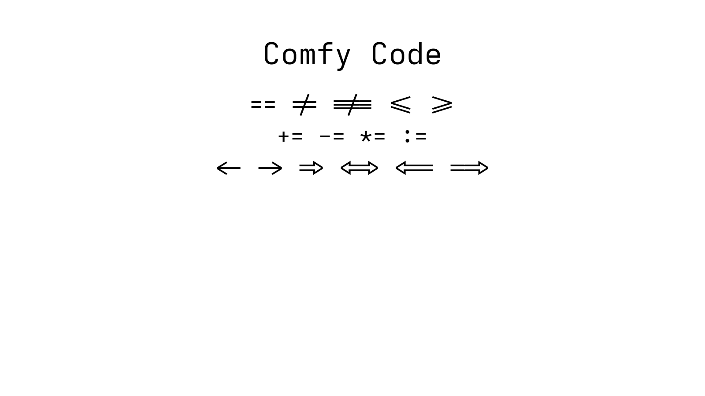

# Comfy Code

A font for code.

## Specimen

A quick at-a-glance view of letterforms, numerals, and punctuation.

  

## Weights & Italics

Light, Regular, Medium, and Bold, each shown in roman and italic with the pangram.

  

## Ligatures

Using a restrained set of ligatures in context.

  

