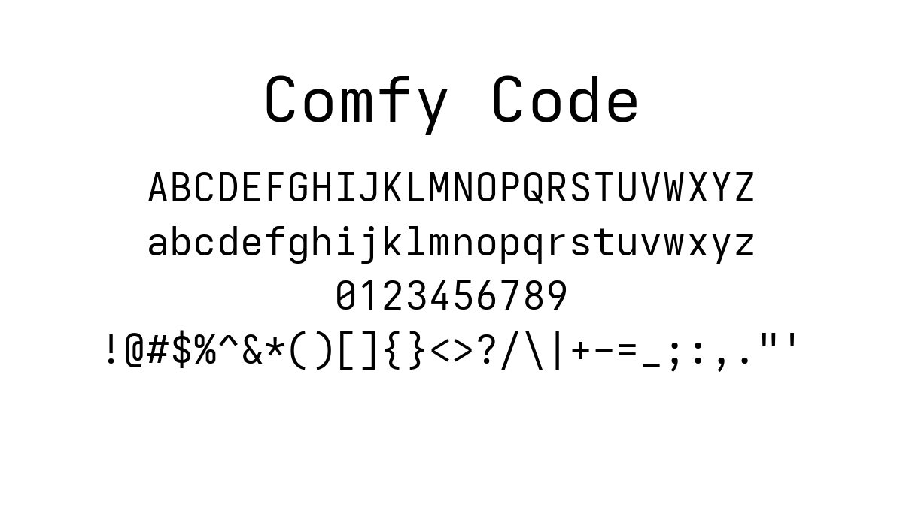
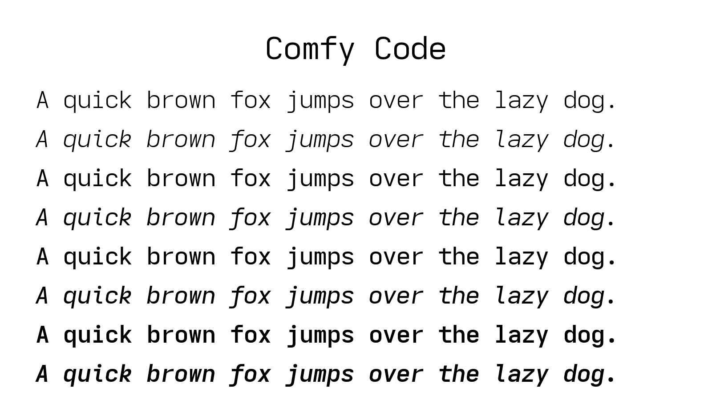

# Comfy Code

A custom build of [Iosevka](https://github.com/be5invis/Iosevka) for comfortable, distraction-free coding.

## Features

- Fixed-pitch, sans-serif letterforms
- Normal and Condensed widths
- Upright and italic styles
- Programming ligatures disabled
- More open letter apertures and compact arrow heights, using native Iosevka parameters
- Hinted TTF, unhinted TTF, and webfont packages

## Specimen

A quick at-a-glance view of letterforms, numerals, and punctuation.

<p align="center">
  
</p>

## Weights & Italics

The preview highlights Light, Regular, Medium, and Bold in both roman and italic. Releases include the full set of generated weights.

<p align="center">
  
</p>

## Download & Install

Download the [latest release](https://github.com/zzhaolei/comfy-code/releases/latest) and choose the package for your use case:

- `ComfyCode-hinted.zip` for desktop use
- `ComfyCode-unhinted.zip` for unhinted TTF files
- `ComfyCode-webfont.zip` for web projects

Extract the archive, then install the TTF files through your operating system or use the included webfont files and CSS in your project.

## Build Locally with Docker

Run these commands from the repository root with Docker running. The image uses the unmodified source version in `IOSEVKA_VERSION` and installs the build tools. The first build downloads the source and dependencies; subsequent image builds reuse Docker's cache. Both configuration files are mounted read-only and loaded on every run.

```bash
# Quick trial: Regular weight, both widths, upright and italic (4 unhinted TTFs).
docker compose run --build --rm fonts preview

# All configured weights, widths, and slopes as unhinted TTFs.
docker compose run --build --rm fonts unhinted

# All weights and all formats: hinted/unhinted TTF and webfonts.
docker compose run --build --rm fonts full
```

Preview fonts appear in `dist/docker/ComfyCodePreview/TTF-Unhinted/` and use the family name **Comfy Code Preview**, so you can install and compare them alongside Comfy Code. Full-family builds appear in `dist/docker/ComfyCode/`. On macOS, open the generated unhinted TTFs in Font Book to install them, then select the font in your editor.

The default is two concurrent jobs. To reduce memory usage, use `BUILD_JOBS=1 docker compose run --build --rm fonts preview`. Keep `--build` when changing `IOSEVKA_VERSION` or Docker build files so the image includes those changes.

## Native Glyph Tuning

`private-build-plans.toml` selects upstream character variants, weights, widths, and slopes. It uses the built-in `c = "serifless"` variant. Geometry adjustments live in `private-parameters.toml`, which Iosevka [loads natively](https://github.com/be5invis/Iosevka/blob/v34.8.1/packages/font/src/param/index.mjs):

```toml
[shapeWeight-serifs-sans.multiplies]
hook = 0.70
arrowHeight = 0.75
```

These multipliers apply after Iosevka interpolates its weight parameters, retaining the upstream weight and width behavior. Reducing `hook` opens `c` and also affects other glyphs that share this parameter, including `C`, `G`, `S`, `f`, `j`, `t`, and some digits. Reducing `arrowHeight` shortens `⇡⇣` and also changes other arrows that share the arrow dimensions. This is a shared geometry adjustment, so its effects extend beyond those three characters. Set either multiplier to `1.0` to restore its upstream value.

Both Docker and GitHub Actions use unmodified Iosevka source. For a manual build, copy `private-build-plans.toml` into the Iosevka root and `private-parameters.toml` into its `params/` directory, then build normally. No source patches or custom character variants are required.

The parameter overlay uses a lower-level native interface than the build plan's `metricOverride` section; check the generated glyphs when updating `IOSEVKA_VERSION`.

## License

The repository configuration and automation are licensed under the [MIT License](LICENSE). Generated fonts are derivatives of Iosevka and remain licensed under the [SIL Open Font License 1.1](https://github.com/be5invis/Iosevka/blob/main/LICENSE.md).
